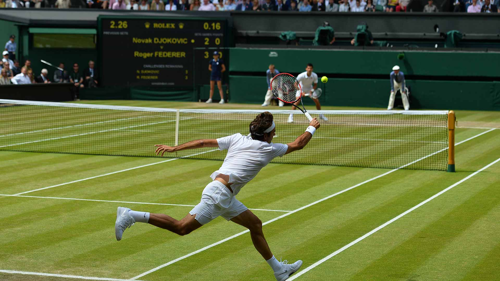
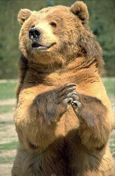
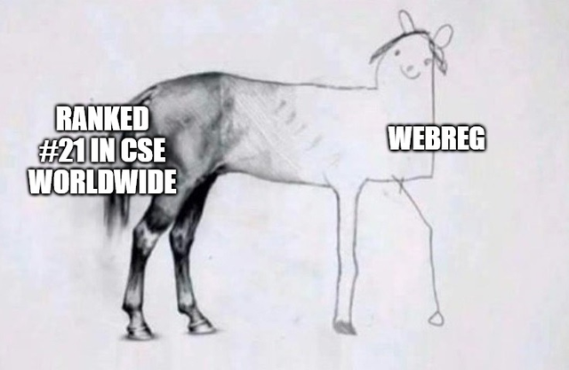

# Ivan Ozerets's Page

### Pictures

### Description

Hello,

My name is Ivan Ozerets. I am 21 and am interested in learning all about machine learning. I grew up in Southern California and have lived here my whole life. My parents both immigrated from Russia just before I was born and gave me one of the greatest gifts a partent can give: a second langueage. That language being Russian obviously. 

I am decently proficient in the following programming languages:
- C++
- Java
- ARM Assembly

*Trying to get into python on my own time recently.*

### Some fun facts about me

My favorite movie: `Avatar` by James Cameron.

My favorite song is some russian song, here's a link: [some sweet russian song](https://www.youtube.com/watch?v=8dVtBAWbZ14).

My favotite food is Borscht (Russain soup).

One of my favorite quotes:

> And those who were seen dancing were thought to be insane by those who could not hear the music - Friedrich Nietzsche

### Finishing touches

A relative link to this page: [this same exact page](index.md)

My current to-do list:

- [X]  Create a to-do list
- [X]  Check off first thing on to-do list
- [X]  Realise you have already completed two things on your to-do list
- [ ]  Reward yourself with a nap

Thanks:)